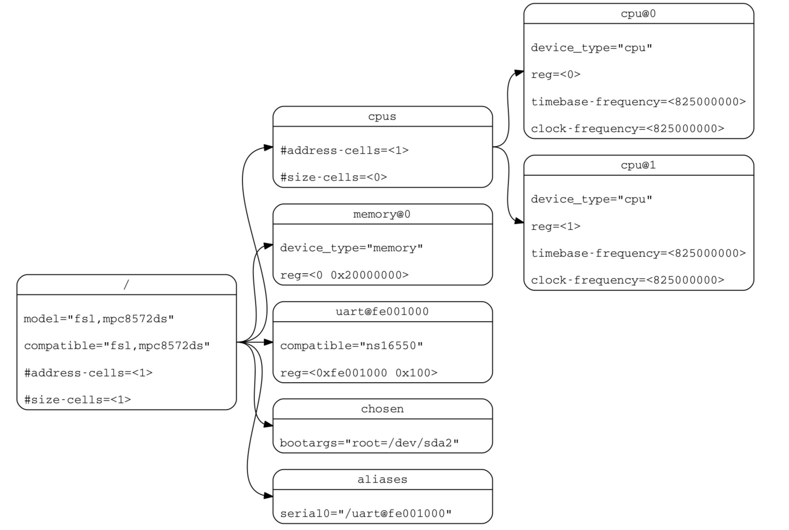
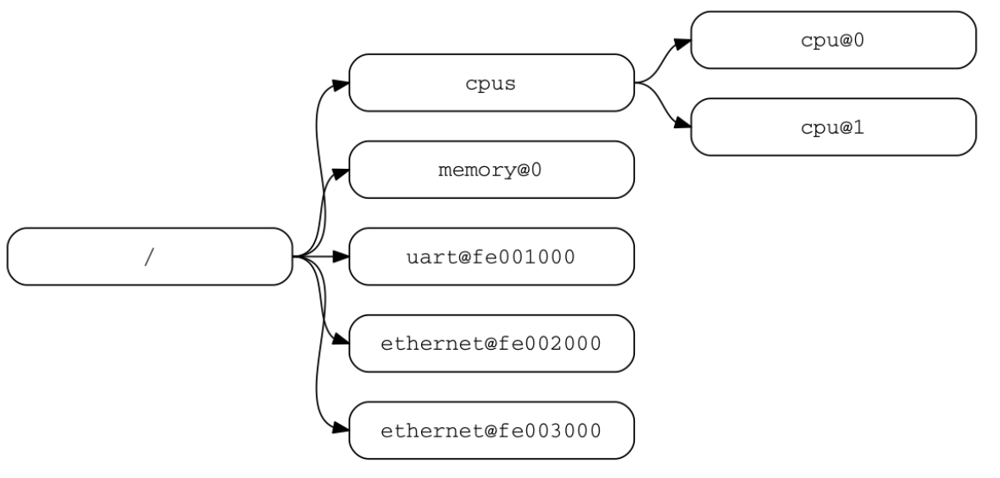

[<目录](../README.md)

## 2设备树

### 2.1概述

设备树规范阐述了一个用于描述系统硬件被称为**设备树**的结构。引导程序加载设备树到这client程序的内存中并把指向设备树的指针传给client程序。

本章节主要内容为设备树的逻辑结果和用于描述设备结点的基本属性集。第三章将通过DTSpec-compliant明确设备结点要求。第四章描述了设备树规范中设备bindings--对于清晰表达设备类型和类别的要求。第五章描述了设备树在内存中的编码格式。

设备树是一个树形的数据结构，它的结点描述了系统中对应的设备。每个结点用属性/值(key-value)对来描述设备的特征，并且除了root根结点以外，每个结点都有唯一的父结点。

在系统中，DTSpec-compliant设备树描述的设备信息，client程序不一定能动态的探测到。例如，PCI的架构使能client程序去探测相关/挂载的设备，因此可能不需要描述PCI设备的**设备树**结点。然而，如果它没能被probing探测到，那描述PCI host bridge设备的设备结点是必要的。

**例如**

**图2.1**为一个足够引导一个有平台类型、CPU、内存和串口的简易操作系统的简单设备树表现形式的例子。设备结点是以属性和值表示的。

<b>图2.1 设备树举例</b>

### 2.2 设备树结构与其规范

#### 2.2.1 结点名

**结点命名规则**

设备树中的每个结点的命名有如下规则:

> node-name@unit-address

其中`node-name`描述了结点的名字。它必须由1到31个有效字符(见表2.1)组成。

<b>表2.1 有效字符</b>

| 字符 | 描述 |
| :---: | :------: |
| 0 - 9 |   数字   |
| a - z | 小写字母 |
| A - Z | 大写字母 |
|   ,   |   逗号   |
|   .   |  小数点  |
|   _   |  下滑线  |
|   +   |   加号   |
|   -   |  破折号  |

`node-name`必须以字母开头且应描述对应设备的类型。

`unit-address`明确了结点所在总线的位置。它由一个或多个表2.1中的`ASCII`字符组成。`unit-address`必须与结点的`reg`属性中的首地址匹配。如果结点没有`reg`属性，`unit-address`必须被省略且`node-name` 不能与同级其它`node-name`相同。特定总线可能会对`reg`和`unit-address`的格式有其他更多具体的要求。

root根结点没有`node-name`和`unit-address`，它用`/`表示。  

<b>图2.2 结点名举例</b>

图2.2：

- 图中名为cpu的结点通过`unit-address`的值0和1来区分
- 图中名为ethernet的结点通过`unit-address`的值`fe001000`和`fe003000`来区分

#### 2.2.2 推荐的通用命名

结点名应该尽可能的通用且能反映出设备的功能，而不是精确的编程模型。如果合适，应该从下面的名字中选择一个：

- adc
- accelerometer
- atm
- audio-codec
- audio-controller
- backlight
- bluetooth
- bus
- cache-controller
- camera
- can
- charger
- clock
- clock-controller
- compact-flash
- cup
- cups
- crypto
- disk
- display
- dma-controller
- dsi
- dsp
- eeprom: 电可擦可编程只读存储器
- efuse
- endpoint
- ethernet
- ethernet-phy
- fdc
- flash
- gnss
- gpio
- gpu
- gyrometer
- hdmi
- hwlock
- i2c
- i2c-mux
- ide
- interrupt-controller
- iommu
- isa
- keyboard
- key
- keys
- lcd-controller
- led
- leds
- led-controller
- light-sensor
- magnetometer
- mailbox
- mdio
- memory
- memory-controller
- mmc
- mmc-slot
- mouse
- nand-controller
- nvram
- oscillator
- parallel
- pc-card
- pci
- pcie
- phy
- pinctrl
- pmic
- pmu
- port
- ports
- power-monitor
- pwm
- regulator
- reset-controller
- rng
- rtc
- sata
- scsi
- serial
- sound
- spi
- sram-controller
- ssi-controller
- syscon
- temperature-sensor
- timer
- touchscreen
- tpm
- usb
- usb-hub
- usb-phy
- video-codec
- vme
- watchdog
- wifi

#### 2.2.3 路径名

设备树中的一个结点能够被从根结点开始的绝对路径所唯一标识，能逐层查找到所描述的结点。

制定一个设备路径的规则是：

> /node-name-1/node-name-2/node-name-N

例如，图2.2中`cup#1`的路径是：

> /cpus/cpu@1

这路径的根结点是`/`。

如果对于结点的绝对路径没有争议，那么`unit-address`可以被省略。

如果一个`Client Program`遇到一个模棱两可的路径，它的行为将是未定义的。

#### 2.2.4 属性