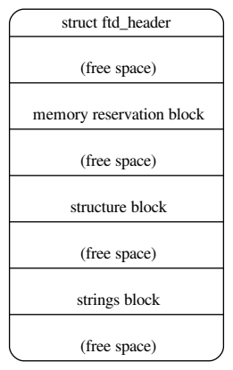

<p align = "center"><b>
    设备树规格书(Devicetree Specification)
</b></p>

<p align = "center">
    <b>
        <a href="https://github.com/Sunrisepeak/devicetree-specification-chinese">中文</a>
        /
        <a href="https://github.com/devicetree-org/devicetree-specification">English</a>
    </b>
</p>

<p align = "center">
    <b>
        <a href="ch04.md">上一章</a>
        -
        <a href="../README.md">目录</a>
        -
        <a href="ch05.md">下一章</a>
    </b>
</p>

---

## 5 Flattened Devicetree (DTB) 格式

Devicetree Blob (DTB) 格式是一种扁平化的二进制编码的 devicetree 数据格式。它用于在软件程序之间交换 devicetree 数据。例如，在启动操作系统时，固件将向操作系统内核传递 DTB。

> 注意： IEEE1275 开放固件 [IEEE1275] 没有定义 DTB 格式。在大多数符合 Open Firmware 标准的平台上，通过调用固件方法来遍历树结构来提取 devicetree。

DTB 格式将 devicetree 数据编码在单个、线性、无指针的数据结构中。它由一个小的头部（参见 [头部](#sect-fdt-header)）、三个可变大小的部分组成：内存保留块（参见 [内存保留块](#sect-fdt-memory-reservation-block)）、结构块（参见 [结构块](#sect-fdt-structure-block)）和字符串块（参见 [字符串块](#sect-fdt-strings-block)）。这些应按照扁平化的 devicetree 的顺序出现。因此，当整个 devicetree 结构在地址处加载到内存中时，它将类似于图 1 中的结构（较低的地址位于图的顶部）。



<p align="center"><b>Fig.5.1 Devicetree .dtb 数据结构</b></p>
  

图中的free space可能不存在，但是在某些情况下可能需要满足单个块的对齐约束(详见5.6节)。 

### 5.1 版本控制

自定义格式定义以来，已经定义了几个扁平化的 devicetree 结构版本。头部中的字段给出了版本，因此客户端程序可以确定 devicetree 是否以兼容的格式编码。

本文档仅描述格式的第 17 个版本。兼容的引导程序应提供版本为 17 或更高版本的 devicetree，并应提供向后兼容版本 16 的 devicetree。兼容的客户端程序应接受向后兼容版本 17 的 devicetree，并可能接受其他版本。

> 注意：版本是针对设备树的二进制结构而言，而不是其内容


### 5.2 头部

devicetree 的头部布局由以下 C 结构定义。所有头部字段都是 32 位整数，以大端格式存储。

#### 扁平化 Devicetree 头部字段

头部中的字段如下：

```c
struct fdt_header {
    uint32_t magic;
    uint32_t totalsize;
    uint32_t off_dt_struct;
    uint32_t off_dt_strings;
    uint32_t off_mem_rsvmap;
    uint32_t version;
    uint32_t last_comp_version;
    uint32_t boot_cpuid_phys;
    uint32_t size_dt_strings;
    uint32_t size_dt_struct;
};
```

- magic：此字段应包含值 0xd00dfeed（大端）。
- totalsize：此字段应包含 devicetree 数据结构的总大小（以字节为单位）。此大小应包括结构的所有部分：头部、内存保留块、结构块和字符串块，以及块之间或最终块之后的任何空闲空间。
- offdtstruct：此字段应包含结构块相对于头部开头的字节偏移量。
- offdtstrings：此字段应包含字符串块相对于头部开头的字节偏移量。
- offmemrsvmap：此字段应包含内存保留块相对于头部开头的字节偏移量。
- version：此字段应包含 devicetree 数据结构的版本。如果使用本文档中定义的结构，则版本为 17。引导程序可以提供更高版本的 devicetree，在这种情况下，此字段应包含在任何后续文档中定义该版本详细信息的版本号。
- lastcompversion：此字段应包含 devicetree 数据结构的最低版本，该版本与使用的版本向后兼容。因此，对于本文档中定义的结构（版本 17），此字段应包含 16，因为版本 17 向后兼容版本 16，但不向后兼容早期版本。根据 :numref:sect-fdt-versioning，引导程序应提供与版本 16 向后兼容的格式的 devicetree，因此此字段应始终包含 16。
- bootcpuidphys：此字段应包含系统引导 CPU 的物理 ID。它应与 devicetree 中该 CPU 节点的 reg 属性中给出的物理 ID 相同。
- sizedtstrings：此字段应包含 devicetree blob 的字符串块部分的字节长度。
- sizedtstruct：此字段应包含 devicetree blob 的结构块部分的字节长度


### 5.3 内存保留块

#### 5.3.1 目的

**内存保留块** 为客户端程序提供了一个物理内存区域列表，这些区域是 *保留的*；也就是说，不应该用于一般的内存分配。它用于保护关键数据结构，以免被客户端程序覆盖。例如，在某些具有 IOMMU 的系统上，引导程序初始化的 TCE（翻译控制条目）表需要以这种方式受到保护。同样，任何在客户端程序运行期间使用的引导程序代码或数据都需要被保留（例如，在 Open Firmware 平台上的 RTAS）。不要求引导程序提供任何这样的运行时组件，但它不禁止实现进行扩展。

更具体地说，客户端程序不应访问保留区域中的内存，除非引导程序提供的其他信息明确指示它应该这样做。然后，客户端程序可以以指定的方式访问保留内存的指定部分。引导程序可以指示客户端程序保留内存的特定用途的方法可能会出现在本文档中、在其可选扩展中或在平台特定的文档中。

引导程序提供的保留区域可以包括设备树 blob 本身，但不是必需的。客户端程序应确保在使用之前不会覆盖此数据结构，无论它是否在保留区域中。

在内存节点中声明并由引导程序访问或在客户端输入后引起访问的任何内存都必须被保留。此类访问的示例包括（例如，通过非受保护的虚拟页面进行的推测性内存读取）。

这个要求是必要的，因为任何未被保留的内存都可能被客户端程序以任意的存储属性访问。


引导程序引起的或由引导程序引起的对保留内存的任何访问都必须作为未缓存且需要内存一致性（即，WIMG = 0bx01x）进行，并且对于 Book III-S 实现，还必须作为不需要写入缓存（即，WIMG = 0b001x）进行。此外，如果支持 VLE 存储属性，则必须将对保留内存的所有访问作为 VLE=0 进行。

这个要求是必要的，因为客户端程序被允许映射存储属性指定为不需要写入缓存、未缓存且需要内存一致性（即，WIMG = 0b001x）和 VLE=0（如果支持）。客户端程序可能使用包含保留内存的大型虚拟页面。但是，客户端程序不能修改保留内存，因此引导程序可以将对保留内存的访问作为需要写入缓存进行，其中对于此存储属性的冲突值是架构允许的。


#### 5.3.2 Format

内存保留块由一系列64位大端整数对组成，每个对由以下C结构表示。

```c

    struct fdt_reserve_entry {
        uint64_t address;
        uint64_t size;
    };
```

每个对都给出了保留内存区域的物理地址和字节数。这些给定的区域不得重叠。保留块的列表应以两个地址和大小都等于0的条目终止。请注意，地址和大小值始终为64位。在32位CPU上，值的高32位将被忽略。

内存保留块中的每个uint64_t，以及整个内存保留块，都必须位于设备树blob的开头处的8字节对齐偏移量处（请参见 :numref:`sect-fdt-alignment`）。

#### 5.3.3 内存保留块和UEFI

与 ``/reserved-memory`` 节点 (:numref:`sect-reserved-memory-uefi`) 一样，当通过[UEFI]_引导时，内存保留块中的条目也必须在通过GetMemoryMap()获取的系统内存映射中列出，以防止UEFI应用程序进行分配。内存保留块条目应以类型 ``EfiReservedMemoryType`` 列出。


### 5.4 结构块

结构块描述了设备树本身的结构和内容。它由一系列带有数据的标记组成，如下所述。这些标记按照线性树结构组织，如下所述。

结构块中的每个标记，以及因此结构块本身，都必须位于设备树blob的开头处的4字节对齐偏移量处（请参见 :numref:`sect-fdt-alignment`）。

#### 5.4.1 词法结构

结构块由一系列片段组成，每个片段以一个标记开头，即一个大端32位整数。某些标记后面跟有额外的数据，其格式由标记值确定。所有标记都必须对齐到32位边界，这可能需要插入填充字节（值为0x0）以在前一个标记的数据后插入。


**以下是五种标记类型：**

``FDT_BEGIN_NODE`` (0x00000001)
    FDT_BEGIN_NODE 标记标志着节点表示的开始。它应该跟随节点的单元名称作为额外的数据。名称存储为以空字符结尾的字符串，并且应包括单元地址（请参见 :numref:`sect-node-names`），如果有的话。节点名称后面跟随零填充字节，如果需要对齐，然后是下一个标记，它可以是除 FDT_END 之外的任何标记。

``FDT_END_NODE`` (0x00000002)
    FDT_END_NODE 标记标志着节点表示的结束。此标记没有额外的数据；因此，它紧接着下一个标记，它可以是除 FDT_PROP 之外的任何标记。

``FDT_PROP`` (0x00000003)
   FDT_PROP 标记标志着在设备树中表示一个属性的开始。它应该跟随描述属性的额外数据。此数据首先由以下 C 结构表示的属性的长度和名称组成：


```c
struct {
    uint32_t len;
    uint32_t nameoff;
}
```

此结构中的两个字段都是32位大端整数。

   * len 给出属性值的长度（以字节为单位）（可能为零，表示空属性，请参见 :numref:`sect-property-values`）。

   * nameoff 给出字符串块中的偏移量（请参见 :numref:`sect-fdt-strings-block`），其中属性的名称存储为以空字符结尾的字符串。

   此结构之后，属性的值以长度为len的字节字符串给出。此值后面跟随零填充字节（如果需要）以对齐到下一个32位边界，然后是下一个标记，它可以是除 FDT_END 之外的任何标记。

``FDT_NOP`` (0x00000004)
    FDT_NOP 标记将被任何解析设备树的程序忽略。此标记没有额外的数据；因此，它紧接着下一个标记，它可以是任何有效标记。可以使用FDT_NOP标记覆盖树中的属性或节点定义，以将其从树中删除，而无需移动树的表示中的其他部分。

``FDT_END`` (0x00000009)
    FDT_END 标记标志着结构块的结束。只能有一个FDT_END标记，它必须是结构块中的最后一个标记。此标记没有额外的数据；因此，FDT_END标记后面的字节与设备树blob头中的size_dt_struct字段的值相等。


#### 5.4.2 树结构

设备树结构表示为线性树：每个节点的表示以FDT_BEGIN_NODE令牌开头，并以FDT_END_NODE令牌结尾。节点的属性和子节点（如果有）在FDT_END_NODE之前表示，以便这些子节点的FDT_BEGIN_NODE和FDT_END_NODE令牌嵌套在父节点的令牌中。

整个结构块由根节点的表示（其中包含所有其他节点的表示）组成，后跟FDT_END令牌，以标记整个结构块的结尾。

更准确地说，每个节点的表示由以下组件组成：

* 任意数量的FDT_NOP令牌（可选）
* FDT_BEGIN_NODE令牌

   * 节点名称作为以空字符结尾的字符串
   * [零填充字节以对齐到4字节边界]

*对于节点的每个属性：

   * 任意数量的FDT_NOP令牌（可选）
   * FDT_PROP令牌

      * numref:`sect-fdt-lexical-structure`中所述的属性信息
      * [零填充字节以对齐到4字节边界]

* 以此格式表示所有子节点
* 任意数量的FDT_NOP令牌（可选）
* FDT_END_NODE令牌

请注意，此过程要求特定节点的所有属性定义在该节点的任何子节点定义之前。尽管如果属性和子节点交织在一起，结构不会产生歧义，但是通过此要求，处理平面树所需的代码得到简化。


### 5.5 字符串块

字符串块包含表示树中使用的所有属性名称的字符串。这些以空字符结尾的字符串在此部分中简单地串联在一起，并通过指向字符串块中的偏移量从结构块中引用。

字符串块没有对齐约束，并且可以出现在从设备树blob的开头的任何偏移量处。


### 5.6 对齐

设备树blob应位于8字节对齐的地址处。为了保持向后兼容性，某些软件支持4字节对齐，但这不符合规范。

为了使内存保留和结构块中的数据在没有未对齐的内存访问的情况下使用，它们应位于适当对齐的内存地址上。具体而言，内存保留块应对齐到8字节边界，结构块应对齐到4字节边界。

此外，整个设备树blob可以重新定位而不破坏子块的对齐。

如前几节所述，结构和字符串块应具有从设备树blob开头的对齐偏移量。为了确保块的内存对齐，只需确保整个设备树在对齐到任何子块的最大对齐方式的地址上加载，即在8字节边界上对齐。符合规范的引导程序应在将设备树blob传递给客户端程序之前将其加载到这样的对齐地址。如果符合规范的客户端程序将设备树blob在内存中重新定位，则应将其重新定位到另一个8字节对齐的地址。

---

<p align = "center">
    <b>
        <a href="ch04.md">上一章</a>
        -
        <a href="../README.md">目录</a>
        -
        <a href="ch05.md">下一章</a>
    </b>
</p>


